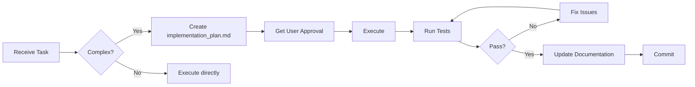

# PetCard Project Rules

> **Scope**: This document defines agent behavior for **Phase 1 MVP** development.  
> **Last Updated**: 2026-01-28

---

## 1. Code Standards

### 1.1 Python (Backend)

| Rule | Requirement |
|------|-------------|
| Style | PEP 8 compliant |
| Type Hints | Required for all function signatures |
| Docstrings | Required for public functions and classes (Google style) |
| Imports | Absolute imports only; group: stdlib → third-party → local |
| Naming | `snake_case` for functions/variables, `PascalCase` for classes |
| Line Length | 88 characters (Black formatter compatible) |

**File Structure**:
```
src/backend/
├── main.py           # FastAPI app init, middleware
├── database.py       # SQLAlchemy engine, session
├── models.py         # SQLAlchemy ORM models
├── schemas.py        # Pydantic request/response schemas
├── auth.py           # JWT utilities
├── routes/           # API routers (one file per domain)
│   ├── auth.py
│   ├── pets.py
│   └── ...
└── tests/            # pytest tests (mirror routes structure)
```

### 1.2 JavaScript/React (Frontend)

| Rule | Requirement |
|------|-------------|
| Components | Functional components only (no class components) |
| State | React Hooks (`useState`, `useEffect`, `useContext`) |
| Props | PropTypes required for all components |
| Naming | `PascalCase` for components, `camelCase` for functions/variables |
| CSS | CSS Modules or inline styles; no global CSS pollution |
| Imports | Relative imports within `src/frontend/` |

**File Structure**:
```
src/frontend/
├── main.jsx          # App entry point
├── App.jsx           # Router + AuthProvider
├── context/          # React context providers
├── screens/          # Full-page components
├── components/       # Reusable UI components
├── services/         # API client (axios)
├── hooks/            # Custom hooks
└── tests/            # Jest tests
```

---

## 2. Project-Specific Constraints

> [!IMPORTANT]  
> **Phase 1 is OWNER-ONLY.** All clinic dashboard, appointment, and AI features are out of scope.

### 2.1 Forbidden Features (Phase 1)

| Feature | Status | Phase |
|---------|--------|-------|
| Clinic Admin Dashboard | ❌ FORBIDDEN | Phase 2 |
| Appointment Booking | ❌ FORBIDDEN | Phase 2 |
| AI Recommendations | ❌ FORBIDDEN | Phase 3 |
| Payment Integration | ❌ FORBIDDEN | Phase 2 |
| SMS/Email Notifications | ❌ FORBIDDEN | Phase 2 |
| Multi-language Support | ❌ FORBIDDEN | Phase 2 |

> [!CAUTION]  
> If a task requires any of the above features, **STOP and notify the user**. Do not implement.

### 2.2 Database Rules

- All schema changes **MUST** go through Alembic migrations
- Never use `Base.metadata.create_all()` in production code
- Foreign keys must have `ON DELETE CASCADE` where appropriate
- All models must have `created_at` and `updated_at` timestamps
- Use SQLite for development, PostgreSQL for production

### 2.3 API Rules

- All endpoints must validate input via Pydantic schemas
- Error responses must use consistent format: `{"detail": "message"}`
- Pet operations must verify ownership (`pet.owner_id == current_user.id`)
- JWT tokens for authentication; no session-based auth

---

## 3. AI Persona & Behavior

### 3.1 LEGO Mindset

> Build modular, replaceable components. Every piece should snap in and out cleanly.

- **Single Responsibility**: Each file/function does one thing well
- **Explicit Dependencies**: No magic globals; inject dependencies
- **Testability First**: Write code that can be unit tested in isolation
- **Documentation**: Code should explain "why," comments explain "what"

### 3.2 Mandatory Workflow



> [!WARNING]  
> For any task affecting database schema, API contracts, or multiple files:  
> **ALWAYS create `implementation_plan.md` BEFORE writing code.**

### 3.3 Pre-Completion Checklist

Before marking any task as complete, verify:

- [ ] All new endpoints have corresponding Pydantic schemas
- [ ] Alembic migration created for schema changes
- [ ] Backend tests pass (`pytest src/backend/tests/`)
- [ ] Frontend tests pass (`npm test` if applicable)
- [ ] No linter errors (`ruff check` for Python, `npm run lint` for JS)
- [ ] Related documentation updated

---

## 4. Standard Operating Procedures (SOP)

### 4.1 Error Handling Protocol

| Situation | Action |
|-----------|--------|
| Test failure | Fix immediately before proceeding |
| Migration conflict | Never force; resolve manually or ask user |
| Ambiguous requirement | Ask clarifying question via `notify_user` |
| Out-of-scope request | Cite this document and refuse politely |
| External dependency issue | Document workaround and notify user |

### 4.2 Documentation Updates

| Event | Update |
|-------|--------|
| New feature implemented | Update `README.md` if user-facing |
| Schema changed | Update `DATA_MODEL_PHASE1.md` |
| API endpoint added/changed | Update `API_SPEC_PHASE1.md` |
| Task completed | Mark item in `task.md` as `[x]` |
| Verification complete | Create/update `walkthrough.md` |

### 4.3 Commit Message Format

```
<type>: <short description>

[optional body with details]
```

Types: `feat`, `fix`, `docs`, `refactor`, `test`, `chore`

Example: `feat: Add vaccine CRUD endpoints`

---

## 5. Tech Stack Reference

| Layer | Technology | Notes |
|-------|------------|-------|
| Backend | FastAPI 0.100+ | Python 3.11+ |
| ORM | SQLAlchemy 2.0 | Async not required for MVP |
| DB | SQLite (dev) / PostgreSQL (prod) | Via Alembic |
| Auth | python-jose (JWT) | Bearer token auth |
| Frontend | React 18+ (Vite) | Telegram Mini App |
| API Client | Axios | Base URL from env |
| Testing | pytest (BE), Jest (FE) | Coverage not mandatory for MVP |
| Bot | python-telegram-bot | Webhook mode |

---

## 6. Quick Reference Commands

```bash
# Backend
cd src/backend && uvicorn main:app --reload --host 0.0.0.0 --port 8000
pytest src/backend/tests/ -v

# Migrations
alembic revision --autogenerate -m "description"
alembic upgrade head

# Frontend
npm run dev
npm test
npm run build

# Linting
ruff check src/backend/
npm run lint
```

---

## Appendix: Entity Relationship (Phase 1)

```
User (1) ──< Pet (N)
                 │
                 ├──< Vaccine (N)
                 ├──< MedicalRecord (N)
                 └──< ClinicCode (0..1)

User (1) ──< TelegramNotification (N)
```

---

> **Remember**: This is an MVP. Simplicity over perfection. Ship, learn, iterate.
